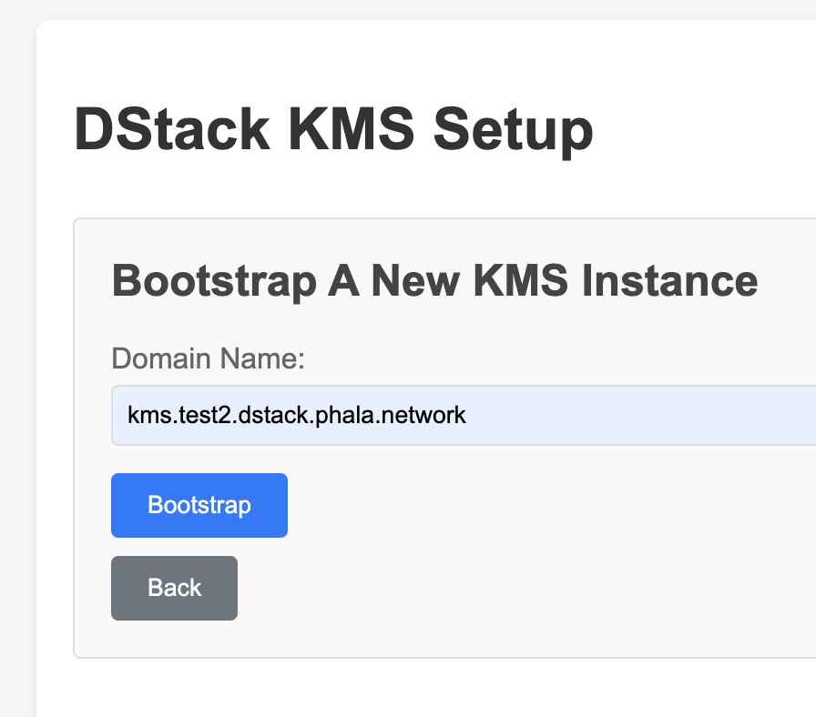
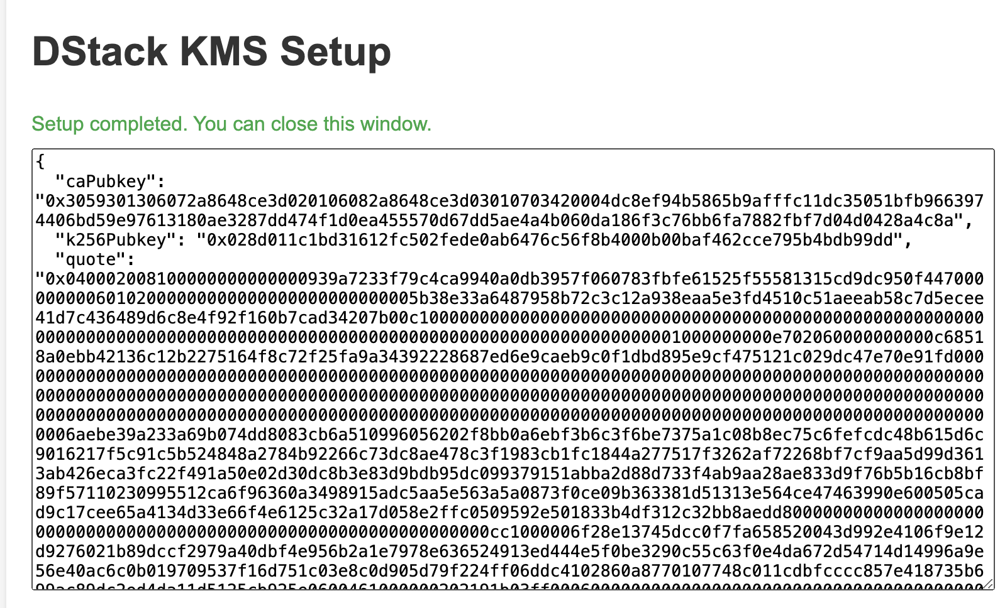
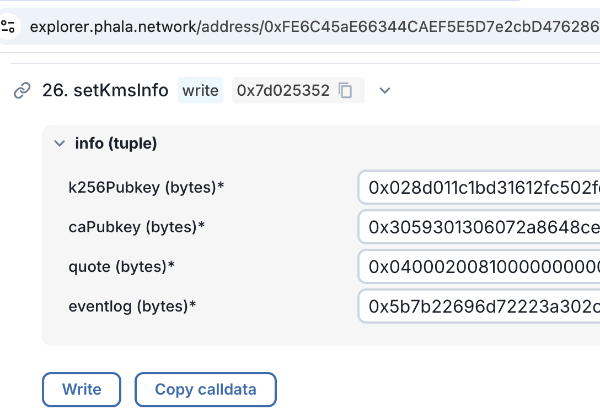
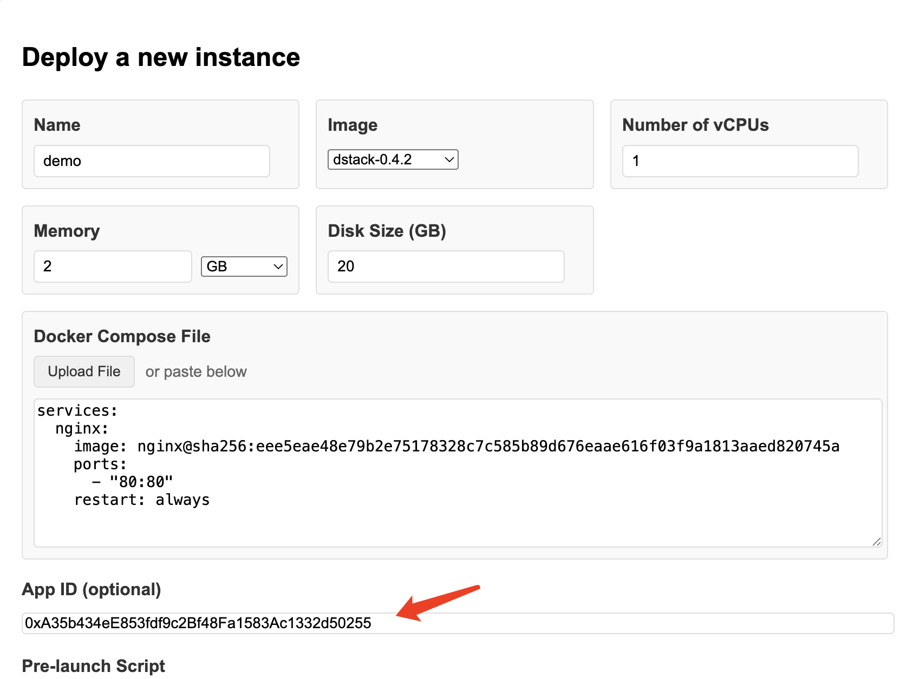
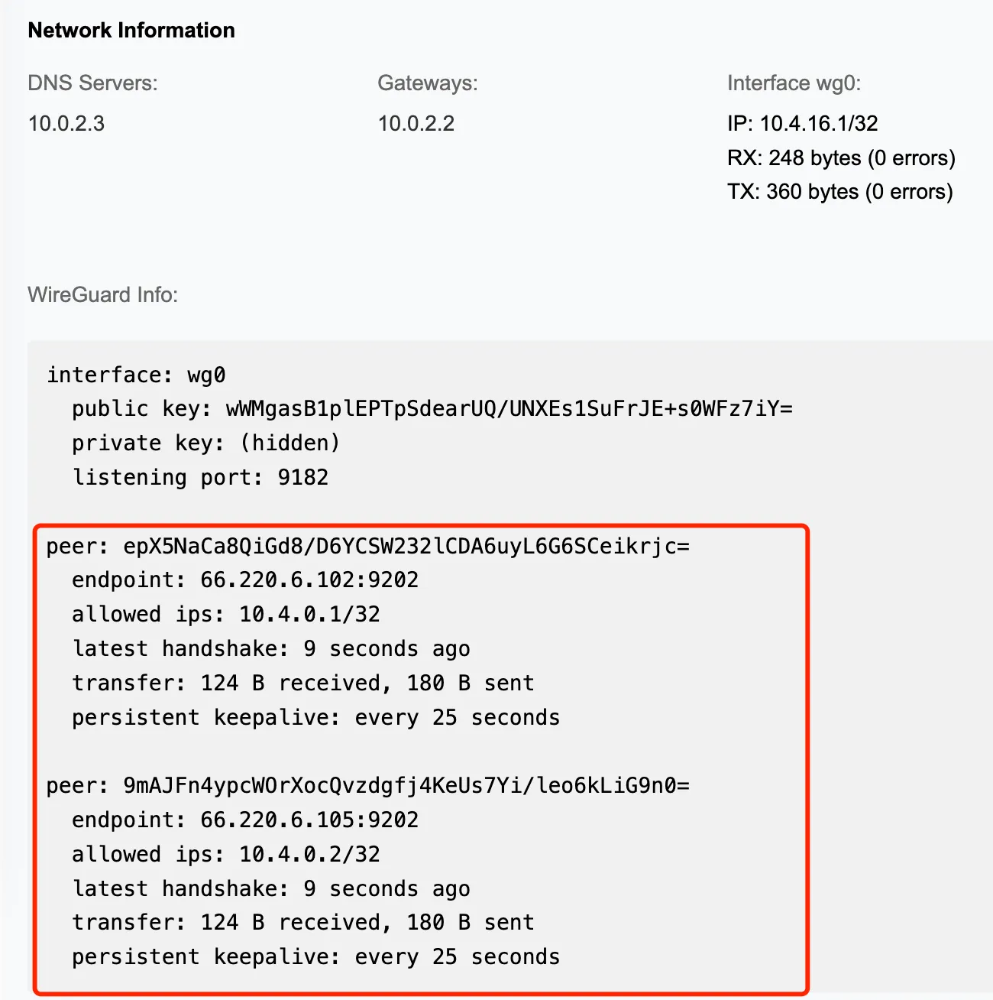

# Deployment of DStack

This document describes the deployment of DStack components on bare metal TDX hosts.
It contains steps to deploy dstack-kms and dstack-gateway into CVMs.

## Prerequisites

- Follow the [TDX setup guide](https://github.com/canonical/tdx) to setup the TDX host.
- Install `cargo` and `rustc`

## Clone the DStack repository
```bash
git clone https://github.com/Dstack-TEE/dstack
```
## Compile and Run dstack-vmm
```bash
cd dstack
cargo build --release -p dstack-vmm -p supervisor
mkdir -p vmm-data
cp target/release/dstack-vmm vmm-data/
cp target/release/supervisor vmm-data/
cd vmm-data/

# create vmm.toml. Edit the config as needed.
cat <<EOF > vmm.toml
address = "unix:./vmm.sock"
reuse = true
image_path = "./images"
run_path = "./run/vm"

[cvm]
kms_urls = ["https://kms.test2.dstack.phala.network:9201"]
gateway_urls = []
cid_start = 30000
cid_pool_size = 1000

[cvm.port_mapping]
enabled = true
address = "127.0.0.1"
range = [
    { protocol = "tcp", from = 1, to = 20000 },
    { protocol = "udp", from = 1, to = 20000 },
]

[host_api]
port = 9300
EOF

# Download Guest OS images
DSTACK_VERSION=0.5.1
wget "https://github.com/Dstack-TEE/meta-dstack/releases/download/v${DSTACK_VERSION}/dstack-${DSTACK_VERSION}.tar.gz"
mkdir -p images/
tar -xvf dstack-${DSTACK_VERSION}.tar.gz -C images/
rm -f dstack-${DSTACK_VERSION}.tar.gz

# run dstack-vmm
./dstack-vmm -c vmm.toml
```

## Deploy the KmsAuth contract

A KMS node requires a KMSAuth contract to be deployed on the Ethereum-compatible network.

```bash
cd dstack/kms/auth-eth
npm install
npx hardhat compile
PRIVATE_KEY=<your-private-key> npx hardhat kms:deploy --network phala
```
It will deploy the KmsAuth contract to the Phala network and print the contract address:

```
Deploying proxy...
Waiting for deployment...
KmsAuth Proxy deployed to: 0xFE6C45aE66344CAEF5E5D7e2cbD476286D651875
Implementation deployed to: 0x5FbDB2315678afecb367f032d93F642f64180aa3
Deployment completed successfully
Transaction hash: 0xd413d01a0640b6193048b0e98afb7c173abe58c74d9cf01f368166bc53f4fefe
```

## Deploy KMS into CVM
The dstack-vmm is running now. Open another terminal and go to the `kms/dstack-app/` directory and run the following command:

```bash
cd dstack/kms/dstack-app/
./deploy-to-vmm.sh
```
It will create a template `.env` file. Edit the `.env` file and set the required variables.
Especially the `KMS_CONTRACT_ADDR` variable set to the address of the KmsAuth Proxy contract deployed in the previous step.
The `IMAGE_DOWNLOAD_URL` variable should be set to the URL of the dstack OS image used to verify the os_image_hash.
```
# .env
VMM_RPC=unix:../../vmm-data/vmm.sock
KMS_CONTRACT_ADDR=0xFE6C45aE66344CAEF5E5D7e2cbD476286D651875
KMS_RPC_ADDR=0.0.0.0:9201
GUEST_AGENT_ADDR=127.0.0.1:9205
ETH_RPC_URL=https://rpc.phala.network
GIT_REV=HEAD
OS_IMAGE=dstack-0.5.1
IMAGE_DOWNLOAD_URL=https://files.kvin.wang/images/mr_{OS_IMAGE_HASH}.tar.gz
```

Then run the script again.

Then it will deploy the KMS CVM to the dstack-vmm. Outputs:

```
App compose file created at: .app-compose.json
Compose hash: ec3d427f62bd60afd520fce0be3b368aba4516434f2ff761f74775f871f5b6e3
Deploying KMS to dstack-vmm...
App ID: ec3d427f62bd60afd520fce0be3b368aba451643
Created VM with ID: f5299298-bf4f-43c0-839c-88c755391f3c
```

Go back to the vmm-data directory and check the status of the KMS CVM:
```bash
cd ../../vmm-data/
tail -f run/vm/f5299298-bf4f-43c0-839c-88c755391f3c/serial.log
```

Wait until the KMS CVM is ready:
```
br-1df48b1c448a: port 2(veth36ab5cb) entered forwarding state
app-compose.sh[882]:  Container dstack-kms-1  Started
app-compose.sh[688]: Pruning unused images
app-compose.sh[8347]: Total reclaimed space: 0B
app-compose.sh[688]: Pruning unused volumes
app-compose.sh[8356]: Total reclaimed space: 0B
[  OK  ] Finished App Compose Service.
[  OK  ] Reached target Multi-User System.
         Starting Record Runlevel Change in UTMP...
[  OK  ] Finished Record Runlevel Change in UTMP.
```

Now open your browser and go to the KMS listening address:
```
http://127.0.0.1:9201/
```
Click Bootstrap button then fill in the domain serving the KMS. For example: `kms.test2.dstack.phala.network`.

You should use the domain name that you will use to access the KMS.
Then click [Bootstrap] -> [Finish setup].
It will display the public key and corresponding TDX quote of the KMS as shown below:

The KMS info should be then set to the kms-auth-contract [here for this example](https://explorer.phala.network/address/0xFE6C45aE66344CAEF5E5D7e2cbD476286D651875?tab=write_proxy&source_address=0xa1b5B4Eb15E9366D2e11943F5fE319b62a6E9Da3#0x7d025352):

The KMS instance is now ready to use.

## Deploy dstack-gateway in CVM
dstack-gateway can be deployed as a dstack app in the same host as the KMS or in a different host.

### Add OS image hash to the KMS whitelist
In order to run user workloads that use the KMS, the OS image hash must be added to the KMS whitelist.

The `os_image_hash` is generated during the image build process. It is stored in the `digest.txt` file.

After you get the `os_image_hash`, you can register it to the KMS whitelist by running the following command:

```bash
cd dstack/kms/auth-eth
npx hardhat kms:add-image --network phala --mr <os-image-hash>
```

### Register dstack-gateway in KMS
As a normal dstack app, it requires the app to be registered in the KmsAuth contract first.

```bash
cd dstack/kms/auth-eth
npx hardhat app:deploy --network phala
```

This will deploy an AppAuth contract in the KmsAuth contract and print the app ID:

```
Deploying proxy...
Waiting for deployment...
AppAuth Proxy deployed to: 0x539D0d59D1742780De41b85b2c3674b24369e292
Implementation deployed to: 0x5aC1671E1Df54994D023F0B05806821d6D84e086
Deployment completed successfully
Transaction hash: 0xceac2ac6d56a40fef903b947d3a05df42ccce66da7f356c5d54afda68277f9a9
Waiting for transaction 0xe144e9007208079e5e82c04f727d2383c58184e74d4f860e62557b5f330ab832 to be confirmed...
App registered in KMS successfully
Registered AppId: 0x31884c4b7775affe4c99735f6c2aff7d7bc6cfcd
```

Now go to the `gateway/dstack-app/` directory and run the following command:
```bash
cd ../../gateway/dstack-app/
./deploy-to-vmm.sh 
```

It will create a template .env file. Edit the .env file and set the required variables.

```
# .env
VMM_RPC=unix:../../vmm-data/vmm.sock

# Cloudflare API token for DNS challenge used to get the SSL certificate.
CF_API_TOKEN=your_cloudflare_api_token
CF_ZONE_ID=your_zone_id

# Service domain
SRV_DOMAIN=test2.dstack.phala.network

# Public IP address
PUBLIC_IP=$(curl -s ifconfig.me)

# Gateway application ID. Register the app in KmsAuth first to get the app ID.
GATEWAY_APP_ID=0x31884c4b7775affe4c99735f6c2aff7d7bc6cfcd

# Whether to use ACME staging (yes/no)
ACME_STAGING=yes

# Subnet index. 0~15
SUBNET_INDEX=0

# My URL. The URL will be synced to other nodes in the cluster so that each node can discover other nodes.
MY_URL=https://gateway.test2.dstack.phala.network:9202

# Bootnode URL. If you want to deploy a multi-node dstack-gateway cluster, set the bootnode URL to the URL of another node already deployed or planed to be deployed later.
BOOTNODE_URL=https://gateway.test2.dstack.phala.network:9202

# DStack OS image name
OS_IMAGE=dstack-0.5.1

# Set defaults for variables that might not be in .env
GIT_REV=HEAD

# Port configurations
GATEWAY_RPC_ADDR=0.0.0.0:9202
GATEWAY_ADMIN_RPC_ADDR=127.0.0.1:9203
GATEWAY_SERVING_ADDR=0.0.0.0:9204
GUEST_AGENT_ADDR=127.0.0.1:9206
WG_ADDR=0.0.0.0:9202
```

Then run the script again.
It should show the prompt to confirm the deployment:
```
App compose file created at: .app-compose.json
Compose hash: 700a50336df7c07c82457b116e144f526c29f6d8f4a0946b3e88065c9beba0f4
Configuration:
VMM_RPC: unix:../../build/vmm.sock
SRV_DOMAIN: test5.dstack.phala.network
PUBLIC_IP: 66.220.6.113
GATEWAY_APP_ID: 31884c4b7775affe4c99735f6c2aff7d7bc6cfcd
MY_URL: https://gateway.test5.dstack.phala.network:9202
BOOTNODE_URL: https://gateway.test2.dstack.phala.network:9202
SUBNET_INDEX: 0
WG_ADDR: 0.0.0.0:9202
GATEWAY_RPC_ADDR: 0.0.0.0:9202
GATEWAY_ADMIN_RPC_ADDR: 127.0.0.1:9203
GATEWAY_SERVING_ADDR: 0.0.0.0:9204
GUEST_AGENT_ADDR: 127.0.0.1:9206
Continue? [y/N]
```

Don't press `y` yet. We need to add the compose hash to the AppAuth contract first. Go back to the `kms/auth-eth` directory and run the following command:

```bash
npx hardhat app:add-hash --network phala --app-id 0x31884c4b7775affe4c99735f6c2aff7d7bc6cfcd 0x700a50336df7c07c82457b116e144f526c29f6d8f4a0946b3e88065c9beba0f4
```

After the transaction is confirmed, you can press `y` to continue the deployment.

Similar to the KMS deployment, it will deploy the dstack-gateway CVM to the dstack-vmm and it will start serving later.

## Deploy dstack-vmm on other TDX hosts to serve user workloads
After the KMS and dstack-gateway are deployed, you can deploy dstack-vmm on other TDX hosts to serve user workloads.
You can follow the steps at the beginning of this document to deploy dstack-vmm on other TDX hosts.
Edit the vmm.toml file to set the KMS and dstack-gateway URLs.

```
# vmm.toml
[cvm]
kms_urls = ["https://kms.test2.dstack.phala.network:9201"]
gateway_urls = ["https://gateway.test2.dstack.phala.network:9202"]
```

Then restart the dstack-vmm.

## Deploy app on the dstack-vmm

After the dstack-vmm is ready, you can deploy an app on it following the steps below.

### 1. On-chain Registration

The on-chain registration process includes two steps:

1. Deploy an App's control contract AppAuth. Developers can develop their own or choose the reference contract from the Dstack repository. Custom contracts need to implement the IAppAuth interface.
2. Call KmsAuth.registerApp(appAuthAddress) to register and obtain the App Id

The Dstack repository provides scripts to complete these two steps:

```bash
git clone https://github.com/Dstack-TEE/dstack
cd dstack/kms/auth-eth
npm install
npx hardhat compile
export PRIVATE_KEY=<your eth private key here>
export KMS_CONTRACT_ADDRESS=0xFE6C45aE66344CAEF5E5D7e2cbD476286D651875
npx hardhat app:deploy --allow-any-device --network phala
```

Command output:
```
Deploying proxy...
Waiting for deployment...
AppAuth Proxy deployed to: 0xD4a546B1C7e63CD4CeD314b2C90108e49191A915
Implementation deployed to: 0x5aC1671E1Df54994D023F0B05806821d6D84e086
Deployment completed successfully
Transaction hash: 0xceac2ac6d56a40fef903b947d3a05df42ccce66da7f356c5d54afda68277f9a9
Waiting for transaction 0xe144e9007208079e5e82c04f727d2383c58184e74d4f860e62557b5f330ab832 to be confirmed...
App registered in KMS successfully
Registered AppId: 0xA35b434eE853fdf9c2Bf48Fa1583Ac1332d50255
```

Note the AppId, which needs to be filled in when deploying cvm.

If you need to upgrade the contract in the future, please backup the `.openzeppelin/unknown-2035.json` file.

### 2. Add the App compose hash to the whitelist

Build app-compose.json and calculate its sha256 to get compose-hash. The compose hash can also be previewed in the dstack-vmm UI.

Call the hardhat command to add it to the whitelist (using AppAuth as an example here; custom AppAuth follows its own custom permission control logic).

```bash
export PRIVATE_KEY=<your eth private key here>
export KMS_CONTRACT_ADDRESS=0xFE6C45aE66344CAEF5E5D7e2cbD476286D651875
npx hardhat app:add-hash --network phala --app-id 0xA35b434eE853fdf9c2Bf48Fa1583Ac1332d50255 0x44d9cb98aaa6ab11f5729fc7d6fd58117585e0e3fbec621612dcee6b2dfbcde5
```

### 3. Deploy instances using dstack-vmm


- Select image `dstack-0.4.2`
- Fill in the AppId applied in the contract during deployment
- Currently, test KmsAuth has set a whitelist for Base image, requiring instance memory to be `≥ 3G` or exactly `= 2G`

After the app starts normally, click [Board] to access.

You can find the connections to dstack-gateway nodes, meaning that the app is now reachable from the internet:


